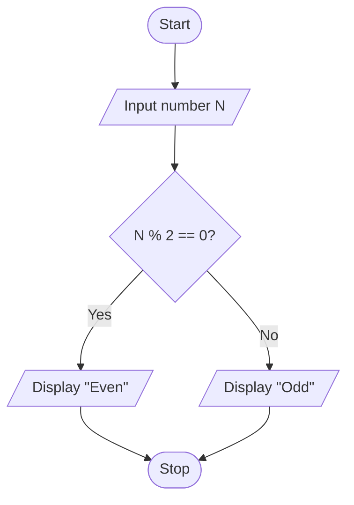

# Q3 — Even or Odd Number

```mermaid
flowchart TD
    A([Start]) --> B[/Input number N/]
    B --> C{N % 2 == 0?}
    C -- Yes --> D[/Display "Even"/]
    C -- No --> E[/Display "Odd"/]
    D --> F([Stop])
    E --> F
```
