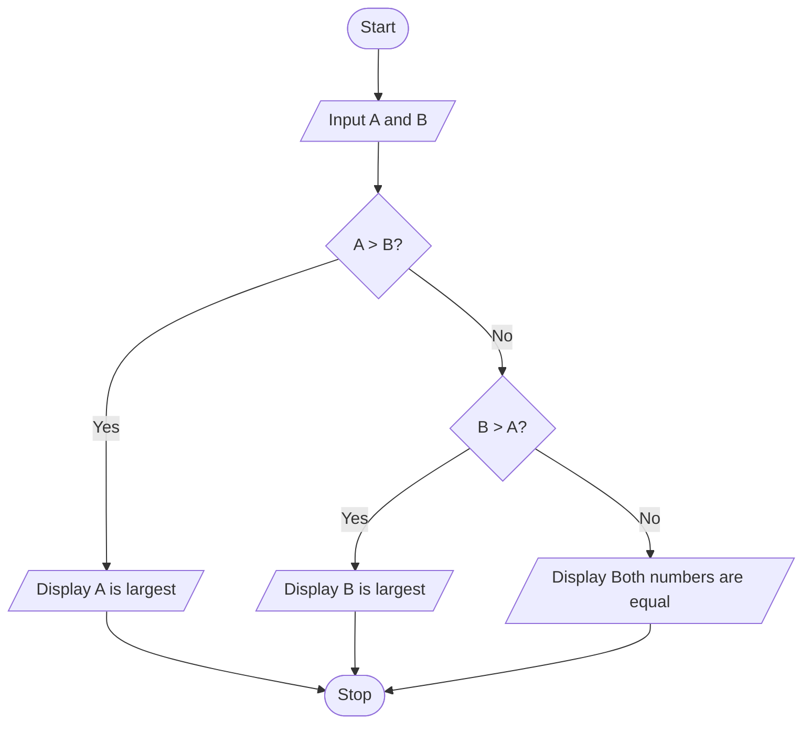

# Q4 — Largest of Two Numbers

```mermaid
flowchart TD
    A([Start]) --> B[/Input A and B/]
    B --> C{A > B?}
    C -- Yes --> D[/Display A is largest/]
    C -- No --> E{B > A?}
    E -- Yes --> F[/Display B is largest/]
    E -- No --> G[/Display Both numbers are equal/]
    D --> H([Stop])
    F --> H
    G --> H
```
